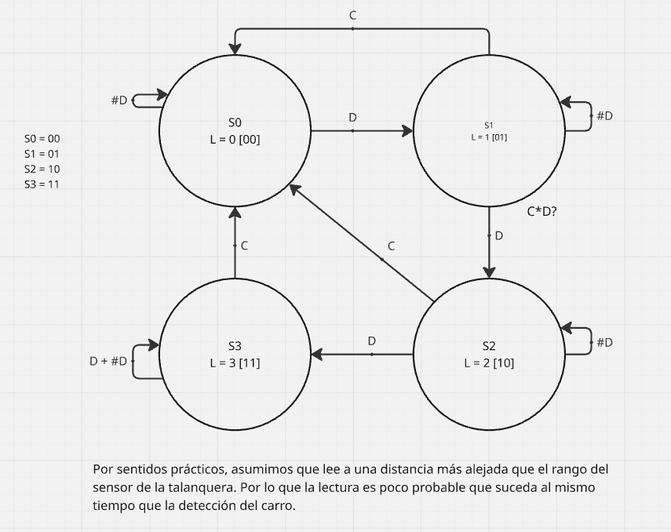
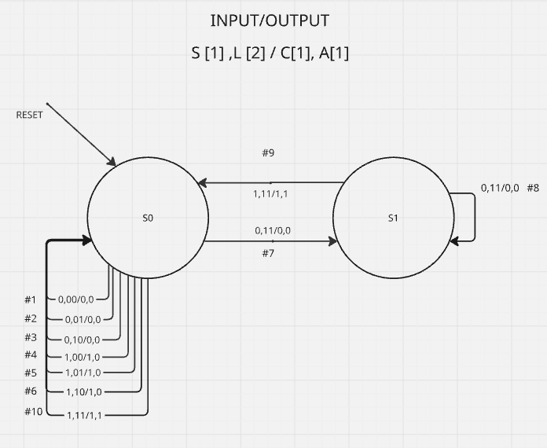

# FSM en HDL
En este apartado se implementa el sistema de VIVEPASS para los centros comerciales de Guatemala. VIVEPASS es un sistema que le permite a los clientes entrar a los parqueos mediante el escaneo de un sticker colocado en el vehículo, con el fin de no tomar ticket y no tener la preocupación de su validación.

## Explicación de Sistema VIVEPASS
Para ejemplificar este sistema se buscó hacerlo de una forma más sencilla. Tomando las siguientes consideraciones:
- El sticker válido de vivepass es aquel que tiene una longitud de 3 dígitos
- El sistema de control de talanqueras no es considerado, ya que forma parte de la lógica de las mismas y no de VIVEPASS

El sistema implementa 2 FSM, una MOORE y MEALY. A continuación se detalla sus funcionalidades:
### MOORE
Se encarga de verificar que el código/sticker contenga una longitud de 3 dígitos. Por ello solo tiene la capacidad de leer hasta 3 dígitos. 
Sus entradas y salidas son:

#### Entradas
1. D = dígito leído [0'bx]
2. C = lectura completada [0'bx]

#### Salidas 
1. L = longitud código/sticker [0'bxx]

#### Mapa de Estados

### MEALY
Se encarga de abrir o cerrar la talanquera dependiendo de la longitud que la MOORE le entregue. Esta comienza a verificar una vez el auto esté lo suficientemente cerca de la talanquera, esto con un sensor que activa el "Start" del análisis.

Sus entradas y salidas son:

#### Entradas
1. L = longitud código [0'bxx]
2. ST = Start [0'bx]
#### Salidas 
1. C = lectura completa [0'bx]
2. A = abrir/cerrar [0'bx]

#### Mapa de estados
