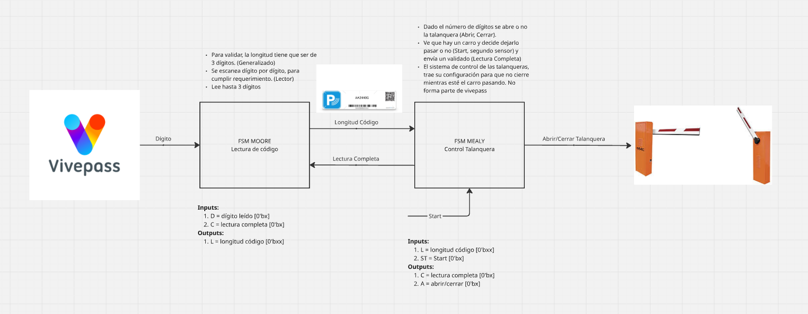

# VivePass – Sistema de Acceso con FSM en HDL

Este proyecto implementa en **SystemVerilog** un sistema de acceso vehicular llamado **VivePass**, diseñado para centros comerciales en Guatemala. El sistema utiliza un **sticker único** en el vehículo que reemplaza el uso de tickets, validando el acceso con **máquinas de estados finitos (FSM)**.  

El diseño se realizó en **Vivado**, y está compuesto por dos FSM:  

1. **FSM Moore** → Valida la longitud del código.  
2. **FSM Mealy** → Controla la talanquera según la validación.  

---

## Estructura del Proyecto
- `src/`  
  - `FSM_Moore.v` → Implementación FSM Moore.  
  - `FSM_Mealy.v` → Implementación FSM Mealy.  
  - `VivePass_system.v` → Integración completa.  

- `img/`  
  - Diagramas de flujo y mapas de estados.  

---

## Proceso General
1. El **lector de código** escanea hasta **3 dígitos**.  
2. La **FSM Moore** determina la longitud (`L`).  
3. La **FSM Mealy** recibe `L` y junto al sensor de proximidad (`ST`) decide **abrir o cerrar la talanquera**.  

---

## Entradas y Salidas

### FSM Moore – Lector de Código
| **Señal** | **Tipo** | **Descripción** |
|-----------|----------|-----------------|
| `D`       | Input    | Dígito leído (0 o 1) |
| `C`       | Input    | Lectura completada (bandera desde Mealy) |
| `L`       | Output   | Longitud del código en bits (`00` a `11`) |

En el código, estas señales corresponden a los puertos `D`, `C` y `L`.  
El diagrama muestra cómo `S0 → S3` representan la longitud en función de los dígitos leídos.  

---

### FSM Mealy – Control de Talanquera
| **Señal** | **Tipo** | **Descripción** |
|-----------|----------|-----------------|
| `L`       | Input    | Longitud recibida de Moore |
| `ST`      | Input    | Sensor que detecta al vehículo cerca |
| `C`       | Output   | Validación de lectura completa |
| `A`       | Output   | Control de la talanquera (`0 = cerrar`, `1 = abrir`) |

En el código, `ST` es la señal clave para activar la evaluación.  
El diagrama Mealy muestra cómo el sistema solo abre (`A=1`) si `L=3` y `ST=1`.  

---

## Diagramas

### Arquitectura General

### Mapa de Estados – FSM Moore

### Mapa de Estados – FSM Mealy

---

## Comparación Diagramas ↔ Código

- **Moore:**  
  - En el diagrama, los estados `S0-S3` representan longitudes de 0 a 3.  
  - En el código, estos estados se definen como un `typedef enum logic [1:0]`.  
  - La salida `L` se asigna en función del estado actual.  

- **Mealy:**  
  - En el diagrama, el estado `S0` espera al vehículo y `S1` gestiona la apertura.  
  - En el código, las condiciones se controlan con combinaciones de `ST` y `L`.  
  - La salida `A` se activa únicamente si `ST=1` y `L=3`.  

---

## Video Explicativo
Aquí puedes ver el video de simulación en Vivado:  

---

